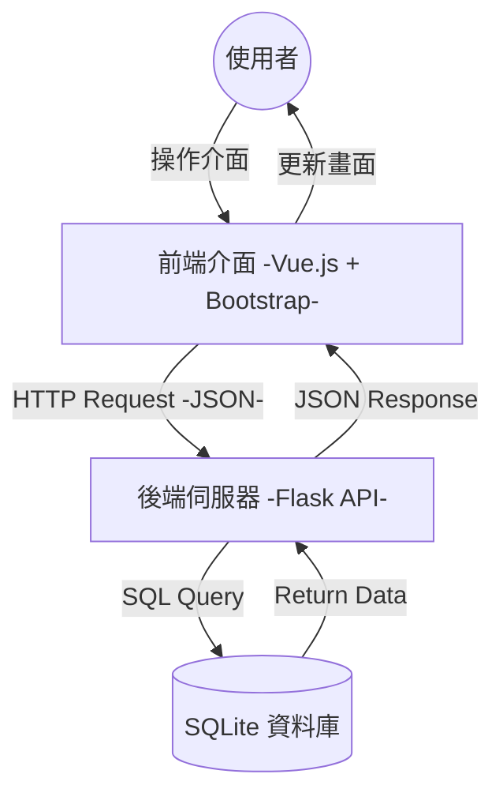
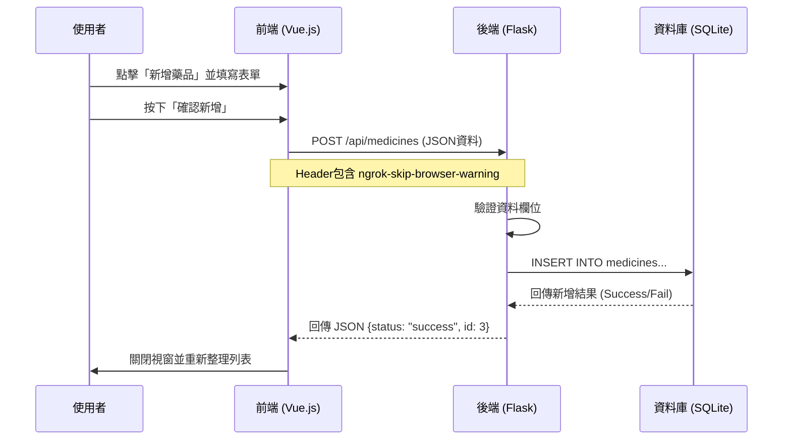

# CRUDDemo
網路程式設計期末專題

## 學生資訊
- 學號：412110123
- 姓名：蔡東霖

# 作業說明：藥品進存貨管理系統

本系統是基於 **Python Flask** 與 **Vue.js** 的 **CRUD**（新增、讀取、更新、刪除）功能與前後端分離的 API 整合架構專案。

## 專案主題與目標

### 主題

**藥品進存貨管理系統**：協助藥局或醫療單位管理藥品的基本資訊、庫存數量與有效期限。

### 目標

1. **視覺化操作**：提供使用者友善的前端介面，直觀地瀏覽與管理庫存。
2. **前後端整合**：透過 RESTful API 連接前端介面與後端資料庫。
3. **CRUD 實作**：完整實作資料的新增 (Create)、讀取 (Read)、更新 (Update) 與刪除 (Delete)。
4. **跨平台支援**：程式碼設計支援 Local (Windows/macOS) 與 Google Colab 環境。


## 技術選型與原因

| 領域 | 技術/工具 | 選擇原因 |
| --- | --- | --- |
| **後端** | **Python Flask** | 輕量級框架，路由設定簡單，適合快速開發微型 API 服務，且易於與資料學科整合。 |
| **資料庫** | **SQLite** | 內建於 Python，無需安裝伺服器，單一檔案即可運作，非常適合中小型專案與教學演示。 |
| **前端** | **Vue.js 3** | 現代化前端框架，具備雙向綁定與元件化特性，透過 CDN 引入即可使用，降低環境建置門檻。 |
| **UI 框架** | **Bootstrap 5** | 提供現成的 RWD 響應式元件 (Modal, Table, Grid)，能快速建構美觀且一致的介面。 |
| **穿透工具** | **PyNgrok** | 用於 Google Colab 環境，將本地 Port 5000 映射至公網，解決雲端環境無法直接存取的問題。 |

---

## 系統架構說明

本系統採用 **前後端分離 (Separation of Concerns)** 的架構設計。前端負責畫面渲染與使用者互動，透過 AJAX (Fetch API) 發送請求；後端負責邏輯處理與資料庫存取。

### 1. 系統架構圖



### 2. CRUD 流程圖 (以新增藥品為例)


### 影片連結

<video src="video_實作.mp4" controls="controls" style="max-width: 730px;">
</video>

---

## 安裝與執行指引

本系統具備**環境自動偵測功能**，可於本機或 Google Colab 執行。

### 前置需求

* Python 3.8+
* Google Chrome 瀏覽器 (建議)

### 方式一：本機執行 (Windows / macOS)

1. **下載專案**
確保檔案結構如下：
```text
project_folder/
├── app.py
└── templates/
    └── index.html

```


2. **安裝依賴套件**
開啟終端機 (Terminal / CMD)，執行：
```bash
pip install flask pyngrok

```


3. **執行程式**
```bash
python app.py

```


4. **操作**
* 程式會詢問 Ngrok Token，若只是本機測試，**直接按 Enter 跳過**。
* 開啟瀏覽器訪問 `http://127.0.0.1:5000` (或 `5001`)。


### 方式二：Google Colab 執行

1. 將 `app.py` 與 `templates/` 資料夾上傳至 Google Drive 指定路徑 (如 `My Drive/GRUDDemo/`)。
2. 在 Colab 開啟 Notebook。
3. 確認程式碼中的路徑變數與你的 Drive 路徑一致。
4. 執行程式碼，輸入 **Ngrok Authtoken**。
5. 點擊產生的 `xxxx.ngrok-free.app` 網址即可使用。

---

## API 規格摘要

完整規格請參閱 [API-SPEC.md]([https://www.google.com/search?q=./api-spec.md](https://github.com/tony940125/CRUDDemo/blob/main/api-spec.md))。

| 功能 | HTTP 方法 | 路徑 | 說明 |
| --- | --- | --- | --- |
| **讀取列表** | `GET` | `/api/medicines` | 取得所有藥品清單 |
| **讀取單筆** | `GET` | `/api/medicines/<id>` | 取得特定 ID 藥品詳情 |
| **新增** | `POST` | `/api/medicines` | 建立新藥品 |
| **更新** | `PUT` | `/api/medicines/<id>` | 修改藥品資料 |
| **刪除** | `DELETE` | `/api/medicines/<id>` | 刪除指定藥品 |

---

## 設計模式應用 (加分項)

本專案在實作過程中，應用了以下軟體設計模式概念：

### 1. 後端：Singleton Pattern (單例模式概念)

* **應用場景**：資料庫連線管理。
* **實作方式**：在 Flask 的 `g` 物件中，我們使用 `get_db()` 函式。它會檢查 `g._database` 是否已存在連線，若有則直接回傳，若無才建立。這確保了在同一個 HTTP Request 的生命週期中，**只會建立唯一的一個資料庫連線**，避免資源浪費。

### 2. 前端：Observer Pattern (觀察者模式)

* **應用場景**：資料與介面的同步 (UI Reactivity)。
* **實作方式**：利用 Vue.js 3 。當 `this.medicines` (資料狀態) 發生改變時，Vue 會自動通知所有綁定該資料的 HTML DOM 元素進行更新 (如表格列表)，開發者無需手動操作 DOM。


